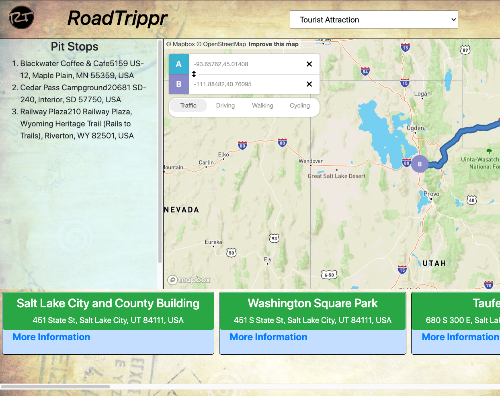

# RoadTrippr
  
  ## Description
  A road trip planner that calculates user's turn-by-turn route and provides points of interest near chosen points along route, stops can be saved to an itinerary.

  URL: https://andrewcodesdontyaknow.github.io/RoadTrippr/
  
  ## Table of Contents

  <a href='#Tools Used'>Installation</a>

  <a href='#How to use'>How to use</a>
  
  <a href='#API Reference'>API Reference</a>
  
  <a href='#Contribution'>Contribution</a>

  <a href='#Credits'>Credits</a>

  <a href='#Questions'>Questions</a>
  
  <a href='#License'>License</a>
  
  Screenshot of Road Trippr's Planning Page
 
 

  ## <a id='Tools Used' style='color:white;'>Tools Used</a>
  The following tools were used in development: Ajax, JQuery, Bootstrap, Javascript, HTML, CSS

  ## <a id='How to use' style='color:white;'>How to use</a>
  Click 'Start' on the homepage to begin. In the map box, enter your starting and ending locations. RoadTrippr will draw your turn-by-turn route. Then, choose a stop type from the dropdown above the map, and click nearby your route in a spot you may want to stop. You will be presented with destinations near your click that match your chosen stop type. Click 'More Information' to view details on that spot, or click the green button to add it to your stop list. Stops will be saved in your local storage.
  
  ## <a id='API Reference' style='color:white;'>API Reference</a>
Mapbox - https://docs.mapbox.com/api/
Trueway Places - https://rapidapi.com/trueway/api/trueway-places

  ## <a id='Contribution' style='color:white;'>Contribution</a>
  Fork the repo and submit potential changes for future development.
  
  ## <a id='Credits' style='color:white;'>Credits</a>
Contributors

Andrew Smith - https://github.com/AndrewCodesDontYaKnow

Emilee Reiter - https://github.com/emileereiter

Nathan Szurek - https://github.com/NathanSzu/

Zeke Enyart - https://github.com/ezekielenyart

  
  ## <a id='Questions' style='color:white;'>Questions</a>
  Contact Andrew Smith with questions at andrewsmith593@gmail.com.

  GitHub Username: AndrewCodesDontYaKnow

  Github Profile: <a href='https://github.com/andrewcodesdontyaknow'>https://github.com/andrewcodesdontyaknow</a>
  
 
 ## <a id='License' style='color:white;'>License</a>
Copyright 2020 Andrew Smith

Permission is hereby granted, free of charge, to any person obtaining a copy of this software and associated documentation files (the "Software"), to deal in the Software without restriction, including without limitation the rights to use, copy, modify, merge, publish, distribute, sublicense, and/or sell copies of the Software, and to permit persons to whom the Software is furnished to do so, subject to the following conditions:

The above copyright notice and this permission notice shall be included in all copies or substantial portions of the Software.

THE SOFTWARE IS PROVIDED "AS IS", WITHOUT WARRANTY OF ANY KIND, EXPRESS OR IMPLIED, INCLUDING BUT NOT LIMITED TO THE WARRANTIES OF MERCHANTABILITY, FITNESS FOR A PARTICULAR PURPOSE AND NONINFRINGEMENT. IN NO EVENT SHALL THE AUTHORS OR COPYRIGHT HOLDERS BE LIABLE FOR ANY CLAIM, DAMAGES OR OTHER LIABILITY, WHETHER IN AN ACTION OF CONTRACT, TORT OR OTHERWISE, ARISING FROM, OUT OF OR IN CONNECTION WITH THE SOFTWARE OR THE USE OR OTHER DEALINGS IN THE SOFTWARE.
  

  <!-- Email: andrewsmith593@gmail.com -->

